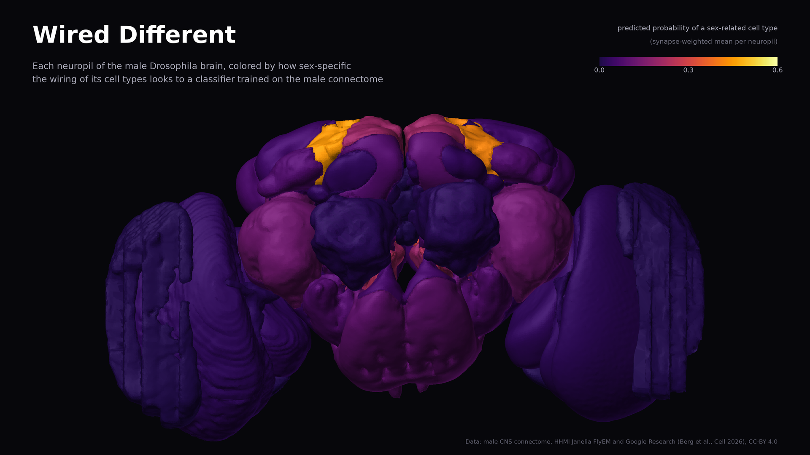

# Wired Different

Google and HHMI Janelia recently published the first complete wiring diagram of a fly's entire central nervous system (about 166,700 neurons and 125 million synapses) and found that roughly 6% of the cell types matched between the sexes differ structurally between male and female brains, concentrated in higher brain centers. We asked whether that difference leaves a detectable signature in the male wiring alone, using no features from the female brain. A classifier trained only on the male connectome predicts published dimorphism labels at AUC-PR 0.759, significantly above a degree-preserving randomized null model (p = 0.002). We use it to flag cell types whose wiring resembles sex-related types as candidates for further investigation. Separately, we reconstruct the well-established Giant Fiber escape circuit from raw graph structure alone, as an independent validation of the underlying methodology.



**Live demo:** <https://dhruvin-sarkar.github.io/ConnectomeLens/>. It has three views: a dimorphism atlas, a circuit pathfinder with node removal, and a guess-the-neuron game.

**Headline result:**

- **All features:** cross-validated AUC-PR **0.759** (chance 0.041). The same model on 500 degree-preserving randomized graphs scored 0.712 ± 0.005, and none matched the real wiring (empirical **p = 0.002**).
- **Graph topology features alone:** 0.489, against 0.070 on the randomized graphs (p = 0.002).

Technical report: [paper/report.pdf](paper/report.pdf) ([source](paper/report.md)).

---

## What this is

The male CNS connectome (`male-cns:v1.0`, Berg et al., *Cell* 2026) labels each cell type as isomorphic, dimorphic or male-specific by comparing it with the female FlyWire brain. This project builds a weighted cell-type graph from the male data only and trains a gradient-boosted classifier on graph and neuropil features. It then tests whether the real wiring predicts those labels better than randomized wiring with identical degrees.

| step | module | output |
|---|---|---|
| neuPrint schema | `pipeline/inspect_schema.py` | local schema notes |
| type labels | `pipeline/ground_truth.py` | 312 male-specific, 166 dimorphic, 11,273 isomorphic types |
| type graph | `pipeline/build_type_graph.py` | 11,751 types, 243,439 edges (each ≥1% of the target's input) |
| features | `pipeline/compute_features.py` | 9 topology + 80 neuropil and transmitter features |
| classifier | `pipeline/train_classifier.py` | [results/classifier_metrics.md](results/classifier_metrics.md) |
| null model | `pipeline/null_model.py` | [results/null_model_validation.md](results/null_model_validation.md), [plot](results/null_distribution.png) |
| pathfinder | `pipeline/pathfinder.py` | LPLC2 → DNp01 (Giant Fiber) → TTMn |
| candidates | `pipeline/candidates.py` | [results/candidates.md](results/candidates.md) |
| node removal | `pipeline/ablation.py` | [results/ablation_report.md](results/ablation_report.md) |
| hero image | `pipeline/render_hero.py` | [assets/hero.png](assets/hero.png), [results/neuropil_scores.csv](results/neuropil_scores.csv) |
| site data | `export/build_static_json.py` | `web/public/data/` |
| demo site | `web/` (React, three.js, Vite) | GitHub Pages via `.github/workflows/pages.yml` |

`verify/` holds one check script per step, and `tests/` holds the unit tests.

## Results

| | value |
|---|---|
| out-of-fold AUC-PR (chance) | 0.759 (0.041) |
| ROC AUC | 0.952 |
| precision in top 100 | 0.99 |
| randomized graphs, all features | 0.712 ± 0.005, 0 of 500 ≥ real, p = 0.002 |
| topology only, real vs randomized | 0.489 vs 0.070 ± 0.004, p = 0.002 |
| static features only | 0.726 |
| hemilineage-grouped cross-validation | 0.701 |
| male-specific / dimorphic types (AUC-PR) | 0.832 / 0.376 |

- **Giant Fiber validation:** the strongest route from the looming detector LPLC2 to the jump motor neuron TTMn runs through DNp01, the Giant Fiber.
- **Node removal:** deleting DNp01 reroutes the LPLC2 → TTMn route through four hops instead of two. The product of output shares falls from 9.45 × 10⁻⁴ to 4.92 × 10⁻⁶.
- **Candidates:** two isomorphic-labeled types, CL062_b3 and CL062_b2, score in the top 1%. Both carry a *fru* annotation, which was not a model input. They are candidates for further investigation, not evidence of dimorphism.

**One pre-specified check fails.** It requires at least one of four named sex-related types to rank in the top 20: AOTU008 (the example shown in Google Research's announcement), AOTU012, DNg13 or LoVP92. They rank 531, 591, 572 and 574. The check is left unchanged and discussed in the technical report.

## Limitations

**May claim:** the classifier's cross-validated AUC-PR and its significance relative to the null model, stated with the actual computed p-value; that this is correlational, not causal; that the candidate list consists of candidates for further investigation, not discoveries; that the ablation result shows structural redundancy consequences, not behavioral ones.

**May never claim:** discovery of new dimorphic neurons; that correlation implies causation about fly behavior; that this is peer-reviewed neuroscience; any number not actually produced and checked by a script in this repository.

The labels themselves come from Janelia's comparison of male and female connectomes. The graph counts chemical synapses only.

## Reproduce

Requirements: Python 3.12, Node 22, GNU Make, and network access to neuPrint and Janelia's public data bucket. The `paper` target also needs pandoc with typst.

```sh
python -m venv .venv && . .venv/bin/activate
pip install -r requirements.txt
make reproduce   # data, model, validations, site export, tests, checks
make paper       # paper/report.pdf
make web         # web/dist
```

Set `NEUPRINT_APPLICATION_CREDENTIALS` to a neuPrint token to query with your account. Without it, the public dataset is queried anonymously.

The 500-graph null model is the slow step: about 1.5 hours on 12 cores. `make checks` exits non-zero while the named-type check above fails.

## Credits and citation

The data are the male adult *Drosophila* CNS connectome from HHMI Janelia FlyEM and Google Research, released under CC-BY 4.0. Please cite the original work:

> Berg S, Beckett IR, Costa M, et al. (2026). Sexual dimorphism in the complete *Drosophila* male central nervous system connectome. *Cell* 189(18):5504–5526.e15. doi:[10.1016/j.cell.2026.08.015](https://doi.org/10.1016/j.cell.2026.08.015)

Also see Google Research's announcement, [A connectomics milestone: Mapping the complete male fruit fly brain](https://research.google/blog/a-connectomics-milestone-mapping-the-complete-male-fruit-fly-brain/). The data were accessed through [neuPrint](https://neuprint.janelia.org), with skeletons processed by [navis](https://github.com/navis-org/navis). Citation metadata for this repository is in [CITATION.cff](CITATION.cff).

Code is released under the [MIT License](LICENSE).
