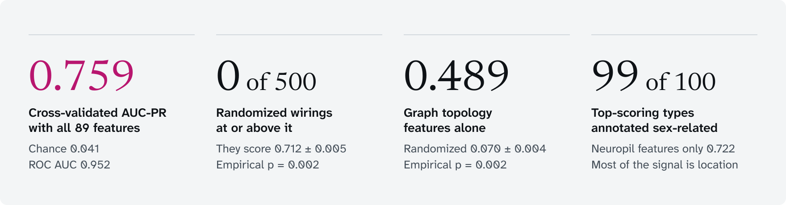
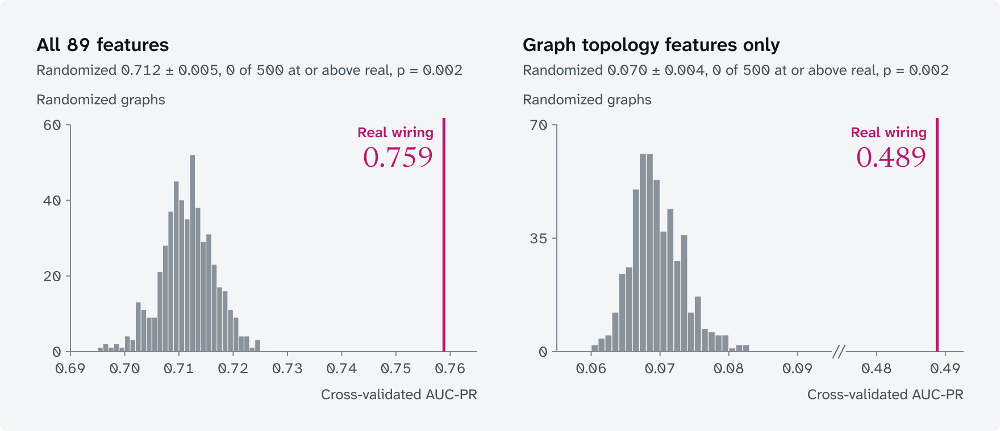
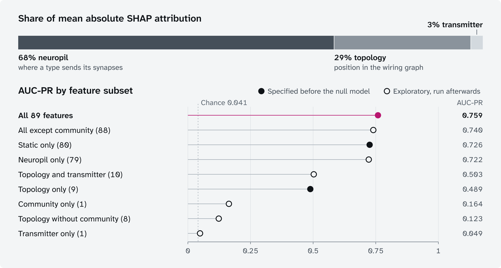
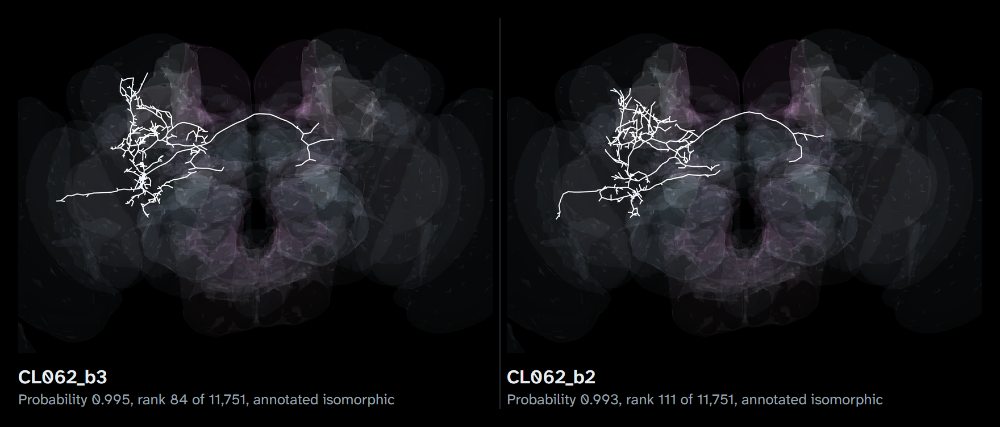
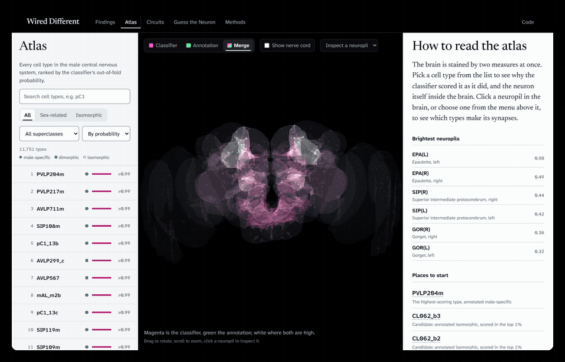
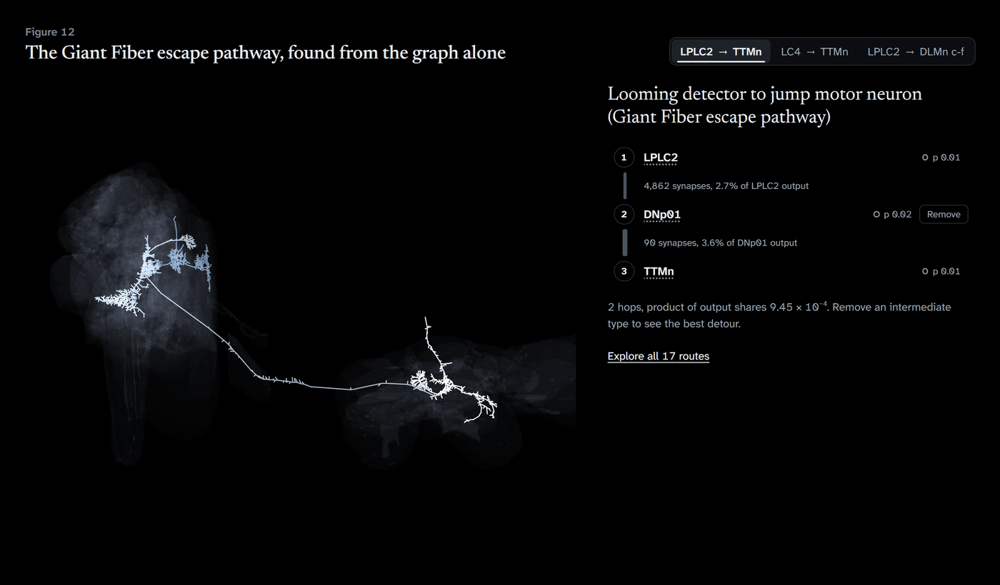
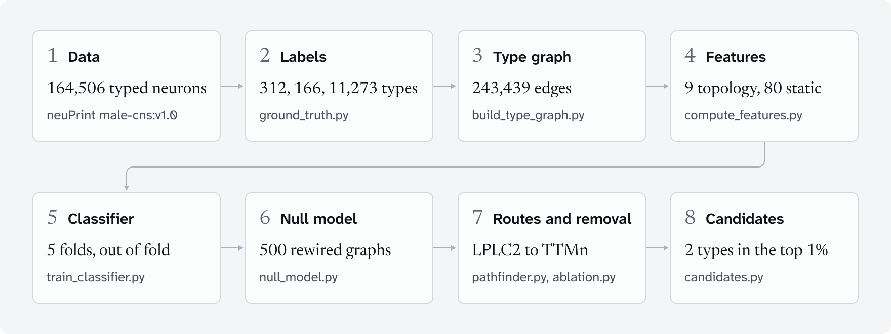
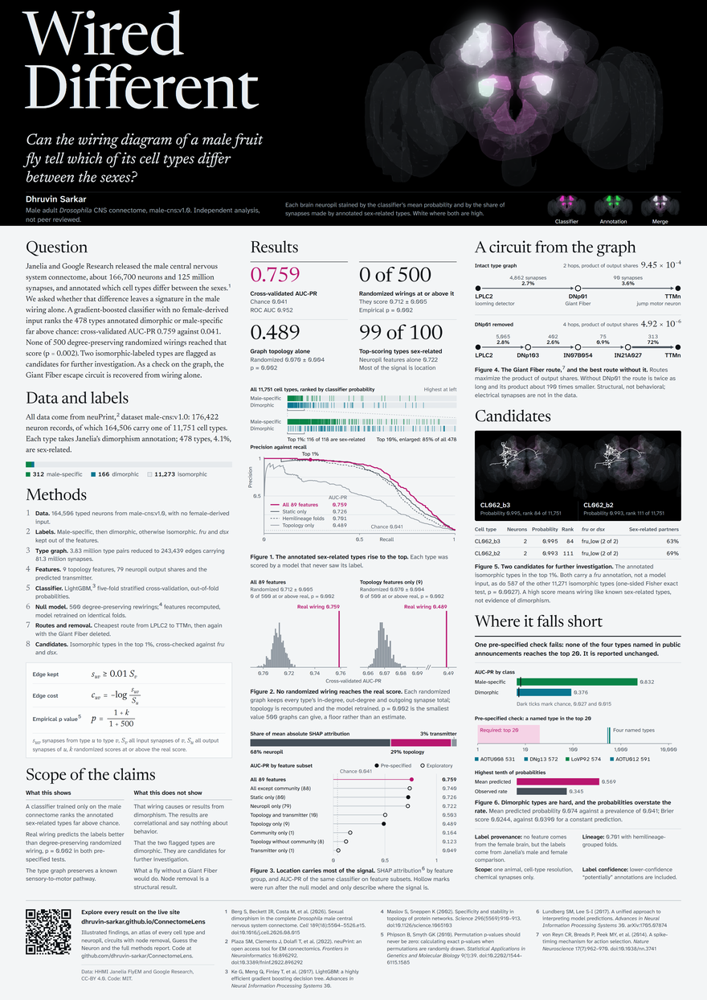

<h1 align="center"><a href="https://dhruvin-sarkar.github.io/ConnectomeLens/"></a></h1>

<p align="center"><b>Yes, far above chance.</b> A classifier trained only on the male wiring ranks the 478 annotated sex-related cell types with a cross-validated AUC-PR of 0.759 against 0.041 by chance, and none of 500 randomized wirings matched it (p = 0.002). Most of that signal turns out to be anatomical location.<br><sub>Dhruvin Sarkar. An independent analysis of public connectome data, not peer reviewed.</sub></p>

<p align="center"><a href="https://dhruvin-sarkar.github.io/ConnectomeLens/">Illustrated&nbsp;findings</a>&emsp;<a href="https://dhruvin-sarkar.github.io/ConnectomeLens/#atlas">Atlas</a>&emsp;<a href="https://dhruvin-sarkar.github.io/ConnectomeLens/#circuits">Circuits</a>&emsp;<a href="https://dhruvin-sarkar.github.io/ConnectomeLens/#game">Guess&nbsp;the&nbsp;Neuron</a>&emsp;<a href="paper/report.pdf">Technical&nbsp;report</a>&emsp;<a href="#the-poster">Poster</a></p>

## Abstract

HHMI Janelia and Google Research have released the first complete wiring diagram of an adult male fruit fly's central nervous system, about 166,700 neurons and 125 million synapses, and found that roughly 6% of the cell types matched between the male and female brains are dimorphic or sex-specific.[^berg] We asked whether that difference leaves a detectable signature in the male wiring alone, using no features from the female brain. A gradient-boosted classifier[^ke] ranks the 478 types annotated dimorphic or male-specific far above chance, with a cross-validated AUC-PR of 0.759 against 0.041. None of 500 degree-preserving randomized wirings reached that score (p = 0.002). Two types annotated isomorphic score in the top 1% and are flagged as candidates for further investigation. As a check on the graph construction, the well-established Giant Fiber escape circuit is recovered from the wiring alone.

## Results

<p><picture><source media="(prefers-color-scheme: dark)" srcset="assets/readme/stat-plate-dark.svg"></picture></p>

> [!IMPORTANT]
> These are statistical associations between a type's place in the male wiring diagram and an existing annotation. They are correlational and say nothing about causes or behavior. Neuropil location carries most of the signal: neuropil features alone reach AUC-PR 0.722, and randomized wirings that keep every non-topology feature still score 0.712.

**Pre-specified checks**

- [x] Both null-model tests are significant at the Bonferroni-corrected level of 0.025 (p = 0.002 each)
- [x] The strongest LPLC2 to TTMn route passes through DNp01, the Giant Fiber
- [ ] At least one of AOTU008, AOTU012, DNg13 or LoVP92 ranks in the top 20 (they rank 531, 591, 572 and 574; see [where it falls short](#where-it-falls-short))

<details>
<summary>All headline values</summary>

| | value |
|---|---|
| out-of-fold AUC-PR (chance) | 0.759 (0.041) |
| ROC AUC | 0.952 |
| precision in top 100 | 0.99 |
| randomized graphs, all features | 0.712 ± 0.005, 0 of 500 ≥ real, p = 0.002 |
| topology only, real vs randomized | 0.489 vs 0.070 ± 0.004, p = 0.002 |
| static features only | 0.726 |
| hemilineage-grouped cross-validation | 0.701 |
| male-specific / dimorphic types (AUC-PR) | 0.832 / 0.376 |

<sub>Source: <a href="results/classifier_metrics.json">results/classifier_metrics.json</a>, <a href="results/null_model_summary.json">results/null_model_summary.json</a></sub>

</details>

<p><picture><source media="(prefers-color-scheme: dark)" srcset="assets/readme/fig-ranking-dark.svg"></picture></p>

**Figure 1. The annotated sex-related types rise to the top of the ranking.** Top: all 11,751 cell types ordered by out-of-fold probability, with male-specific types in green and dimorphic types in cyan; below it, the top 10% enlarged. Bottom: precision against recall for the full model and three comparisons: static features only, hemilineage-grouped folds and topology features only. Out-of-fold means every type was scored by a model that never saw its label. The top 1% (118 types) holds 116 sex-related types, and the top 10% holds 85% of all 478.

<details>
<summary>Values behind Figure 1</summary>

| flagged | types | sex-related among them | precision | share of all 478 sex-related types |
|---|---:|---:|---:|---:|
| top 1% | 118 | 116 | 0.98 | 24% |
| top 5% | 588 | 350 | 0.60 | 73% |
| top 10% | 1,175 | 405 | 0.34 | 85% |

| folds | fold 1 | fold 2 | fold 3 | fold 4 | fold 5 | pooled AUC-PR |
|---|---:|---:|---:|---:|---:|---:|
| stratified by label | 0.743 | 0.753 | 0.772 | 0.787 | 0.750 | 0.759 |
| grouped by hemilineage (1,124 groups) | 0.683 | 0.709 | 0.751 | 0.627 | 0.746 | 0.701 |

| class | types | AUC-PR | chance |
|---|---:|---:|---:|
| male-specific | 312 | 0.832 | 0.027 |
| dimorphic | 166 | 0.376 | 0.015 |

Each class is scored against isomorphic types only, using the same out-of-fold probabilities.

<sub>Source: <a href="results/model_diagnostics.md">results/model_diagnostics.md</a>, <a href="results/classifier_metrics.md">results/classifier_metrics.md</a></sub>

</details>

## The real wiring against 500 randomized wirings

<p><picture><source media="(prefers-color-scheme: dark)" srcset="assets/readme/fig-null-dark.svg"></picture></p>

**Figure 2. No randomized wiring reaches the real score.** Each randomized graph keeps every cell type's exact in-degree, out-degree and outgoing synapse total, and shuffles its partners.[^maslov] All nine topology features were recomputed on each graph, and the identical model was retrained with identical folds. p-values are one-sided and empirical.[^phipson] Because no randomized graph reached the real score, p = 0.002, the smallest value 500 graphs can give. It is a floor, not a precise estimate.

| | all 89 features | topology only (9) |
|---|---:|---:|
| real wiring | 0.759 | 0.489 |
| randomized, mean ± sd | 0.712 ± 0.005 | 0.070 ± 0.004 |
| randomized, range | 0.696 to 0.725 | 0.060 to 0.082 |
| randomized at or above real | 0 of 500 | 0 of 500 |
| z | 9.6 | 111 |
| empirical p | 0.002 | 0.002 |

All 500 scores are in [results/null_model_scores.csv](results/null_model_scores.csv), which GitHub shows as a searchable table.

The two tests answer different questions. Static features alone reach 0.726, and the randomized wirings keep them, so for the full model real wiring adds a small but consistent increment on top of location and transmitter. The topology-only test is where the gap is wide: the real graph scores seven times higher than randomized graphs with the same degrees.

## Where the signal sits

<p><picture><source media="(prefers-color-scheme: dark)" srcset="assets/readme/fig-signal-dark.svg"></picture></p>

**Figure 3. Location carries most of the signal; wiring community carries most of the rest.** Top: the share of mean absolute SHAP attribution[^lundberg] by feature group (neuropil 68%, topology 29%, transmitter 3%). Bottom: AUC-PR of the same classifier trained on feature subsets. Filled marks were specified before any randomized graph was scored; open marks were run afterwards and only describe where the signal is. The largest single attribution is Leiden community membership:[^traag] community 2 holds 256 of the 312 male-specific and 75 of the 166 dimorphic types, and its output centers on SMP, SIP and CRE.

<details>
<summary>Values behind Figure 3</summary>

| features | count | AUC-PR | ROC AUC | precision in top 100 | status |
|---|---:|---:|---:|---:|---|
| all features | 89 | 0.759 | 0.952 | 0.99 | pre-specified |
| all except community | 88 | 0.740 | 0.945 | 1.00 | exploratory |
| static only | 80 | 0.726 | 0.946 | 0.98 | pre-specified |
| neuropil only | 79 | 0.722 | 0.945 | 0.98 | exploratory |
| topology and transmitter | 10 | 0.503 | 0.902 | 0.83 | exploratory |
| topology only | 9 | 0.489 | 0.894 | 0.78 | pre-specified |
| community only | 1 | 0.164 | 0.818 | 0.22 | exploratory |
| topology without community | 8 | 0.123 | 0.783 | 0.15 | exploratory |
| transmitter only | 1 | 0.049 | 0.559 | 0.05 | exploratory |

The 15 features with the largest mean absolute SHAP value (log-odds), each type explained by the fold model that scored it:

| feature | group | mean absolute SHAP | mean SHAP, sex-related | mean SHAP, isomorphic |
|---|---|---:|---:|---:|
| Leiden community | topology | 0.828 | +1.485 | −0.101 |
| output share in PLP | neuropil | 0.462 | +0.307 | −0.003 |
| output share in SIP | neuropil | 0.455 | +1.146 | −0.026 |
| output share in SLP | neuropil | 0.367 | +0.152 | +0.004 |
| in-strength | topology | 0.352 | +0.192 | +0.007 |
| output share in unassigned central brain | neuropil | 0.267 | +0.232 | −0.020 |
| in-degree | topology | 0.264 | +0.059 | +0.002 |
| PageRank | topology | 0.250 | −0.006 | −0.005 |
| output share in SCL | neuropil | 0.227 | +0.382 | −0.053 |
| output share in SPS | neuropil | 0.218 | +0.111 | +0.002 |
| output share in WED | neuropil | 0.205 | +0.063 | −0.004 |
| predicted transmitter | transmitter | 0.203 | +0.061 | −0.001 |
| output share in LegNp(T1) | neuropil | 0.195 | +0.062 | −0.002 |
| output share in AVLP | neuropil | 0.192 | +0.403 | −0.022 |
| output share in unassigned ventral nerve cord | neuropil | 0.188 | +0.043 | −0.033 |

<sub>Source: <a href="results/model_diagnostics.md">results/model_diagnostics.md</a></sub>

</details>

## A circuit recovered from the graph

<p><a href="https://dhruvin-sarkar.github.io/ConnectomeLens/#circuits?route=0&amp;removed=DNp01"><picture><source media="(prefers-color-scheme: dark)" srcset="assets/readme/fig-route-dark.svg"></picture></a></p>

**Figure 4. The Giant Fiber route, and the best route left without it.** Each connection costs the negative log of its share of the upstream type's output synapses, so the cheapest route has the largest product of output shares. The validation pair was fixed before the search. The route from the looming detector LPLC2 to the jump motor neuron TTMn runs through DNp01, the Giant Fiber.[^vonreyn] Deleting DNp01 leaves a route twice as long, with a product about 190 times smaller (9.45&nbsp;×&nbsp;10⁻⁴ to 4.92&nbsp;×&nbsp;10⁻⁶). This describes redundancy in the wiring diagram, not what a fly without a Giant Fiber would do. Electrical synapses, which carry part of the Giant Fiber's output, are not in the data.

<details>
<summary>All three routes before and after removal</summary>

DNp01 is the only intermediate type on the LPLC2 → TTMn route (probability 0.024), so it is the type removed. Deleting it disconnects none of the three routes.

| route | intermediates, intact | intermediates, DNp01 removed | output-share product |
|---|---|---|---|
| LPLC2 → TTMn | DNp01 (2&nbsp;hops) | DNp103, IN07B054, IN21A027 (4&nbsp;hops) | 9.45&nbsp;×&nbsp;10⁻⁴ → 4.92&nbsp;×&nbsp;10⁻⁶ |
| LC4 → TTMn | DNp01 (2&nbsp;hops) | DNp11, IN21A026 (3&nbsp;hops) | 1.64&nbsp;×&nbsp;10⁻³ → 1.55&nbsp;×&nbsp;10⁻⁴ |
| LPLC2 → DLMn&nbsp;c-f | DNp01, IN18B034 (3&nbsp;hops) | LPLC4, DNp31 (3&nbsp;hops) | 1.39&nbsp;×&nbsp;10⁻⁴ → 2.83&nbsp;×&nbsp;10⁻⁵ |

Synapses on each connection, in route order:

| route | types in order | synapses |
|---|---|---|
| LPLC2 → TTMn, intact | LPLC2, DNp01, TTMn | 4,862; 90 |
| LPLC2 → TTMn, DNp01 removed | LPLC2, DNp103, IN07B054, IN21A027, TTMn | 5,065; 402; 75; 313 |
| LC4 → TTMn, intact | LC4, DNp01, TTMn | 6,362; 90 |
| LC4 → TTMn, DNp01 removed | LC4, DNp11, IN21A026, TTMn | 3,666; 112; 507 |
| LPLC2 → DLMn&nbsp;c-f, intact | LPLC2, DNp01, IN18B034, DLMn&nbsp;c-f | 4,862; 75; 1,233 |
| LPLC2 → DLMn&nbsp;c-f, DNp01 removed | LPLC2, LPLC4, DNp31, DLMn&nbsp;c-f | 3,476; 2,022; 1,128 |

<sub>Source: <a href="results/ablation_report.md">results/ablation_report.md</a></sub>

</details>

## Candidates for further investigation

<p><a href="https://dhruvin-sarkar.github.io/ConnectomeLens/#atlas?type=CL062_b3"></a></p>

**Figure 5. The two annotated isomorphic types the classifier scores highest.** The rule was fixed in advance: a type annotated isomorphic whose out-of-fold probability is in the top 1% (0.993 or higher). Two qualify, each of two neurons. For both, the largest contributions are membership of wiring community 2 and output shares in SIP and EPA. *fru* and *dsx* were not model inputs, yet both carry a *fru* annotation, as do 587 of the other 11,271 isomorphic types (one-sided Fisher exact test, p = 0.0027). *fru*-expressing neurons are common in the circuits the model keys on, so this is not independent confirmation.

| cell type | probability | rank of 11,751 | *fru*/*dsx* | sex-related partners |
|---|---:|---:|---|---:|
| [CL062_b3](https://dhruvin-sarkar.github.io/ConnectomeLens/#atlas?type=CL062_b3) | 0.995 | 84 | fru_low (2 of 2) | 63% |
| [CL062_b2](https://dhruvin-sarkar.github.io/ConnectomeLens/#atlas?type=CL062_b2) | 0.993 | 111 | fru_low (2 of 2) | 69% |

<sub>Sex-related partners is the share of a type's strong input and output partners in the graph that carry a sex-related annotation. Source: <a href="results/candidates.md">results/candidates.md</a></sub>

**A high score means a type is wired like known sex-related types. It is not evidence of dimorphism; that needs the female connectome or light-microscopy anatomy.**

## Where it falls short

> [!CAUTION]
> One pre-specified check fails. It required at least one of four sex-related types named in public announcements to rank in the top 20: AOTU008 (the example in Google Research's announcement), AOTU012, DNg13 or LoVP92. They rank 531, 591, 572 and 574. The check is reported unchanged, and `make checks` exits non-zero while it fails.

<p><picture><source media="(prefers-color-scheme: dark)" srcset="assets/readme/fig-limits-dark.svg"></picture></p>

**Figure 6. Dimorphic types are hard, the named types rank near 550, and the probabilities overstate the rate.** Dimorphic neurons exist in both sexes and differ in arbor or partners. That is harder to see from one sex than membership of a male-specific cluster. The probabilities rank types well, but the mean predicted value is 0.074 against a prevalence of 0.041. Brier score 0.0244, against 0.0390 for predicting the prevalence.

- **Label provenance:** no feature comes from the female brain, but the labels themselves come from Janelia's comparison of the male and female connectomes.
- **Anatomy carries most of the signal:** neuropil output shares alone reach AUC-PR 0.722; real wiring adds a small but consistent increment on top.
- **Lineage:** keeping each hemilineage inside one fold lowers AUC-PR to 0.701, so part of the score reflects sibling types that share a lineage.
- **Scope:** one animal, at cell-type resolution, with chemical synapses only.
- **Fixed choices:** the 1% edge threshold and the hyperparameters were fixed before evaluation; other choices would change the topology features.
- **Precision of p:** with 500 randomized graphs, p = 0.002 is a floor rather than a precise estimate.
- **Label confidence:** the labels include lower-confidence "potentially" annotations.
- **Review:** none of this has been peer reviewed.

<details>
<summary>Calibration and named types</summary>

Types in ten equal-count bins of out-of-fold probability:

| probability range | types | mean probability | observed sex-related rate |
|---|---:|---:|---:|
| 0.00003 to 0.00055 | 1,176 | 0.000 | 0.000 |
| 0.00055 to 0.00125 | 1,175 | 0.001 | 0.001 |
| 0.00126 to 0.00237 | 1,175 | 0.002 | 0.003 |
| 0.00237 to 0.00413 | 1,175 | 0.003 | 0.002 |
| 0.00413 to 0.00723 | 1,175 | 0.006 | 0.006 |
| 0.00724 to 0.01292 | 1,175 | 0.010 | 0.003 |
| 0.01293 to 0.02375 | 1,175 | 0.018 | 0.009 |
| 0.02376 to 0.05157 | 1,175 | 0.035 | 0.009 |
| 0.05158 to 0.17483 | 1,175 | 0.095 | 0.029 |
| 0.17506 to 0.99814 | 1,175 | 0.569 | 0.345 |

| named cell type | rank | probability | label |
|---|---:|---:|---|
| AOTU008 | 531 | 0.569 | dimorphic |
| DNg13 | 572 | 0.520 | dimorphic |
| LoVP92 | 574 | 0.518 | male-specific |
| AOTU012 | 591 | 0.502 | dimorphic |

<sub>Source: <a href="results/model_diagnostics.json">results/model_diagnostics.json</a>, <a href="results/model_diagnostics.md">results/model_diagnostics.md</a></sub>

</details>

## Explore the site

The live site is an illustrated version of everything above. Each image opens the view it shows.

**[Atlas](https://dhruvin-sarkar.github.io/ConnectomeLens/#atlas):** every cell type and neuropil, with the classifier score, SHAP reasons, synapse locations, graph-position percentiles, strongest partners, and a reconstructed neuron of the type drawn inside the stained brain.

<p><a href="https://dhruvin-sarkar.github.io/ConnectomeLens/#atlas?type=CL062_b3"></a><br><sub>Looking up CL062_b3: probability 0.995, rank 84 of 11,751, drawn inside the stained brain next to the features that raised its score. A candidate for further investigation, not evidence of dimorphism.</sub></p>

**[Circuits](https://dhruvin-sarkar.github.io/ConnectomeLens/#circuits?route=0&removed=DNp01):** 17 curated routes between sensory, courtship, descending and motor cell types, with node removal.

<p><a href="https://dhruvin-sarkar.github.io/ConnectomeLens/#circuits?route=0&amp;removed=DNp01"></a><br><sub>Removing DNp01 in the findings article's Figure 12. The best remaining route takes four hops instead of two and the product of output shares falls from 9.45&nbsp;×&nbsp;10⁻⁴ to 4.92&nbsp;×&nbsp;10⁻⁶. The Circuits page offers the same removal for all 17 routes. A structural result, not a behavioral one.</sub></p>

- **[Findings](https://dhruvin-sarkar.github.io/ConnectomeLens/):** a long-form illustrated article with 12 interactive figures: the type census, a wiring similarity map, a precision-recall explorer, a degree-preserving rewiring demo with the null distributions, a SHAP attribution beeswarm, the feature-set comparison, wiring communities, neuropil agreement, topology distributions, a limitations panel, the candidate types with 3D skeletons, and the Giant Fiber circuit with node removal.
- **[Guess the Neuron](https://dhruvin-sarkar.github.io/ConnectomeLens/#game):** a 10-round game that pairs a sex-related type with an isomorphic type of the same superclass and dominant neuropil, answered with a tap or the <kbd>A</kbd> and <kbd>B</kbd> keys.
- **[Methods](https://dhruvin-sarkar.github.io/ConnectomeLens/#methods):** the full technical report on the web, with tables of all features, classifier settings, folds, the null model, calibration, all node removals, the pre-specified checks, limitations, software versions and references.

<p><a href="https://dhruvin-sarkar.github.io/ConnectomeLens/"></a><br><sub>Findings, Guess the Neuron and Methods at phone width.</sub></p>

## Methods

<p><a href="https://dhruvin-sarkar.github.io/ConnectomeLens/#methods"><picture><source media="(prefers-color-scheme: dark)" srcset="assets/readme/methods-pipeline-dark.svg"></picture></a></p>

1. **Data.** The male CNS connectome, `male-cns:v1.0`, queried through neuPrint.[^plaza] The database holds 176,422 neuron records, of which 164,506 carry one of 11,751 cell types. No FlyWire data, no cross-dataset matching field and no female-derived quantity is used as a model input.
2. **Labels.** Janelia's per-neuron dimorphism annotations are reduced to one label per type, in priority order: male-specific (including potentially male-specific), then dimorphic (including potentially dimorphic), otherwise isomorphic. That gives 312 male-specific, 166 dimorphic and 11,273 isomorphic types, so the task is binary: 478 sex-related types (4.1%) against the rest. *fru* and *dsx* expression annotations are excluded from the features, because they would leak the label.
3. **Type graph.** Neuron-to-neuron synapse counts between typed neurons sum to 3.83 million type pairs carrying 122.3 million synapses. An edge from type $u$ to type $v$ is kept when it supplies at least 1% of $v$'s input synapses, and self-loops are removed, which leaves 243,439 edges carrying 81.3 million synapses:

   ```math
   s_{uv} \ge 0.01 \sum_{w} s_{wv}
   ```

   Here $s_{uv}$ is the number of synapses from $u$ onto $v$, and the sum runs over every type $w$ that synapses onto $v$. The threshold was chosen from graph statistics before any model was trained.
4. **Features.** Nine topology features computed from the graph: in-degree, out-degree, in-strength, out-strength, PageRank, betweenness, Leiden community membership,[^traag] hop distance from the nearest sensory type and hop distance to the nearest descending or motor type. Eighty static features describe a type without reference to topology: its predicted neurotransmitter and the share of its output synapses in each of 79 bilateral neuropils.
5. **Classifier.** LightGBM[^ke] with hyperparameters fixed before evaluation, scored by five-fold stratified cross-validation (seed 20260914). Every probability reported is out-of-fold. The primary metric is AUC-PR, whose chance level equals the positive rate of 0.041.
6. **Null model.** 500 randomized graphs, each the real graph after 10 × |E| degree-preserving swap attempts.[^maslov] Every type keeps its in-degree and out-degree, and its outgoing synapse counts are shuffled across its new edges, so out-strength is preserved too. The nine topology features are recomputed on each graph and the identical model is retrained with identical folds. The empirical one-sided p-value[^phipson] is one plus the number of randomized graphs that score at or above the real graph, divided by 501:

   ```math
   p = \frac{1 + \#\{\, b : \mathrm{AUCPR}_b \ge \mathrm{AUCPR}_{\mathrm{real}} \,\}}{1 + 500}
   ```

   The two tests, all features and topology features only, are each assessed at a Bonferroni-corrected 0.025.
7. **Routes and node removal.** Dijkstra's algorithm on an edge cost equal to the negative log of the share of the upstream type's output synapses, where $S_u$ is the total output synapses of $u$:

   ```math
   c_{uv} = -\log \frac{s_{uv}}{S_u}
   ```

   A route's cost is the negative log of the product of its output shares, so the cheapest route has the largest product. The intermediate type with the highest classifier probability on the LPLC2 to TTMn route is then deleted, and the search runs again for three routes.
8. **Candidates.** A candidate is a type annotated isomorphic whose out-of-fold probability is in the top 1% of all types, a rule fixed before candidate counts were inspected. Each is explained by its three largest SHAP contributions[^lundberg] from the fold model that scored it, and the candidates are cross-checked against *fru*/*dsx* annotations with a one-sided Fisher exact test.

<details>
<summary>Classifier settings</summary>

| setting | value |
|---|---|
| trees | 400 |
| learning rate | 0.03 |
| leaves per tree | 15 |
| minimum samples per leaf | 20 |
| row subsampling | 0.8, every iteration |
| column subsampling | 0.8 |
| L2 penalty | 1 |
| positive-class weight | the class ratio |
| cross-validation | five folds, stratified, seed 20260914 |

The hyperparameters were fixed before evaluation and never tuned. Weighting the positive class makes the probabilities rank types well but overstate how often a type is sex-related.

</details>

<details>
<summary>Software</summary>

| package | version |
|---|---|
| Python | 3.12.12 |
| neuprint-python | 0.6.3 |
| python-igraph | 1.0.0 |
| LightGBM | 4.7.0 |
| scikit-learn | 1.9.1 |
| SHAP | 0.52.0 |
| navis | 1.12.0 |
| NumPy / pandas / SciPy | 2.5.3 / 3.0.5 / 1.18.1 |

</details>

## The poster

<p align="center"><a href="assets/readme/wired-different-poster.png"></a></p>
<p align="center">One-page summary, 3508 × 4960 pixels. <a href="assets/readme/wired-different-poster.png">Open the full-size poster</a></p>

## Data and outputs

Every number on this page comes from a file in this repository. These are the ones worth opening directly, with nothing installed and nothing run.

| file | what it holds |
|---|---|
| [web/public/data/types.json](web/public/data/types.json) | all 11,751 cell types with their out-of-fold probability, dimorphism label, superclass, predicted transmitter, wiring community and dominant neuropils |
| [web/public/data/explanations.json](web/public/data/explanations.json) | the largest SHAP contributions behind each type's score, written out in words |
| [results/null_model_scores.csv](results/null_model_scores.csv) | the AUC-PR of all 500 randomized wirings in both tests, which GitHub renders as a searchable table |
| [results/model_diagnostics.json](results/model_diagnostics.json) | calibration bins, feature-subset scores, SHAP attributions and breakdowns by superclass and community |
| [results/candidates.md](results/candidates.md) | the two candidate types with their features, *fru*/*dsx* cross-reference and Fisher test |
| [web/public/data/routes.json](web/public/data/routes.json) | the 17 curated routes with synapse counts, output shares and the result of every node removal |

## Reproduce

Requirements: Python 3.12, Node 22, GNU Make, and network access to neuPrint and Janelia's public data bucket. The `paper` target also needs pandoc with typst.

```sh
python -m venv .venv && . .venv/bin/activate
pip install -r requirements.txt
make reproduce   # data, model, validate, export, test and checks, in that order
make paper       # paper/report.pdf
make web         # web/dist
```

The stages can also be run on their own: `make data` (schema, labels, type graph, features), `make model` (classifier and the Giant Fiber route), `make validate` (null model, candidates, node removal, diagnostics, hero image), `make export` (site data), `make test` (unit tests) and `make checks` (every check script).

Set `NEUPRINT_APPLICATION_CREDENTIALS` to a neuPrint token to query with your account. Without it, the public dataset is queried anonymously.

The 500-graph null model is the slow step: about 1.5 hours on 12 cores. `make checks` exits non-zero while the named-type check above fails.

<details open>
<summary>Pipeline modules and outputs</summary>

| step | module | output |
|---|---|---|
| neuPrint schema | `pipeline/inspect_schema.py` | local schema notes |
| type labels | `pipeline/ground_truth.py` | 312 male-specific, 166 dimorphic, 11,273 isomorphic types |
| type graph | `pipeline/build_type_graph.py` | 11,751 types, 243,439 edges (each ≥1% of the target's input) |
| features | `pipeline/compute_features.py` | 9 topology + 80 neuropil and transmitter features |
| classifier | `pipeline/train_classifier.py` | [results/classifier_metrics.md](results/classifier_metrics.md) |
| null model | `pipeline/null_model.py` | [results/null_model_validation.md](results/null_model_validation.md), [plot](results/null_distribution.png) |
| pathfinder | `pipeline/pathfinder.py` | LPLC2 → DNp01 (Giant Fiber) → TTMn |
| candidates | `pipeline/candidates.py` | [results/candidates.md](results/candidates.md) |
| node removal | `pipeline/ablation.py` | [results/ablation_report.md](results/ablation_report.md) |
| diagnostics | `pipeline/model_diagnostics.py` | calibration, SHAP attributions, and breakdowns by feature subset, superclass and community: [results/model_diagnostics.json](results/model_diagnostics.json), [summary](results/model_diagnostics.md) |
| hero image | `pipeline/render_hero.py` | [assets/hero.png](assets/hero.png), [results/neuropil_scores.csv](results/neuropil_scores.csv) |
| README figures | `pipeline/render_readme_figures.py` | `assets/readme/fig-*.svg` |
| site data | `export/build_static_json.py` | `web/public/data/` |
| demo site | `web/` (React, three.js, Vite) | GitHub Pages via `.github/workflows/pages.yml` |

`verify/` holds one check script per step, and `tests/` holds the unit tests. The README figures are drawn with `python -m pipeline.render_readme_figures --font-dir <folder>`, where the folder holds static TTF instances of Newsreader and Atkinson Hyperlegible Next; without it, matplotlib's default fonts are used.

</details>

## Credits and citation

The data are the male adult *Drosophila* CNS connectome from HHMI Janelia FlyEM and Google Research, released under CC-BY 4.0. Please cite the original work:

> Berg S, Beckett IR, Costa M, et al. (2026). Sexual dimorphism in the complete *Drosophila* male central nervous system connectome. *Cell* 189(18):5504–5526.e15. doi:[10.1016/j.cell.2026.08.015](https://doi.org/10.1016/j.cell.2026.08.015)

Also see Google Research's announcement, [A connectomics milestone: Mapping the complete male fruit fly brain](https://research.google/blog/a-connectomics-milestone-mapping-the-complete-male-fruit-fly-brain/). The data were accessed through [neuPrint](https://neuprint.janelia.org), with skeletons processed by [navis](https://github.com/navis-org/navis). Citation metadata for this repository is in [CITATION.cff](CITATION.cff).

Code is released under the [MIT License](LICENSE).

### Citing this work

```bibtex
@software{sarkar2026wired,
  author = {Sarkar, Dhruvin},
  title  = {Wired Different: predicting sexual dimorphism from male {Drosophila} connectome wiring},
  year   = {2026},
  url    = {https://dhruvin-sarkar.github.io/ConnectomeLens/},
  note   = {Independent analysis of public connectome data, not peer reviewed}
}
```

[^berg]: Berg S, Beckett IR, Costa M, et al. (2026). Sexual dimorphism in the complete *Drosophila* male central nervous system connectome. *Cell* 189(18):5504–5526.e15. doi:[10.1016/j.cell.2026.08.015](https://doi.org/10.1016/j.cell.2026.08.015)
[^ke]: Ke G, Meng Q, Finley T, et al. (2017). LightGBM: a highly efficient gradient boosting decision tree. *Advances in Neural Information Processing Systems* 30.
[^maslov]: Maslov S, Sneppen K (2002). Specificity and stability in topology of protein networks. *Science* 296(5569):910–913. doi:[10.1126/science.1065103](https://doi.org/10.1126/science.1065103)
[^phipson]: Phipson B, Smyth GK (2010). Permutation p-values should never be zero: calculating exact p-values when permutations are randomly drawn. *Statistical Applications in Genetics and Molecular Biology* 9(1):39. doi:[10.2202/1544-6115.1585](https://doi.org/10.2202/1544-6115.1585)
[^lundberg]: Lundberg SM, Lee S-I (2017). A unified approach to interpreting model predictions. *Advances in Neural Information Processing Systems* 30. [arXiv:1705.07874](https://arxiv.org/abs/1705.07874)
[^traag]: Traag VA, Waltman L, van Eck NJ (2019). From Louvain to Leiden: guaranteeing well-connected communities. *Scientific Reports* 9:5233. doi:[10.1038/s41598-019-41695-z](https://doi.org/10.1038/s41598-019-41695-z)
[^vonreyn]: von Reyn CR, Breads P, Peek MY, et al. (2014). A spike-timing mechanism for action selection. *Nature Neuroscience* 17(7):962–970. doi:[10.1038/nn.3741](https://doi.org/10.1038/nn.3741)
[^plaza]: Plaza SM, Clements J, Dolafi T, et al. (2022). neuPrint: an open access tool for EM connectomics. *Frontiers in Neuroinformatics* 16:896292. doi:[10.3389/fninf.2022.896292](https://doi.org/10.3389/fninf.2022.896292)
