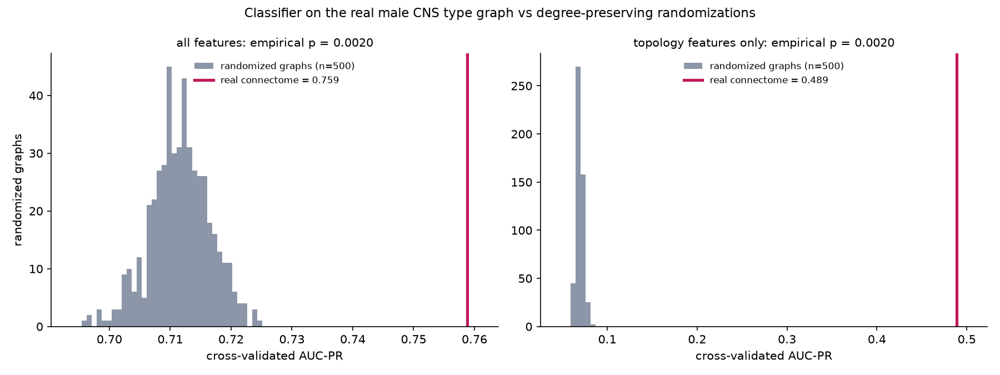

# Null-model validation

## Question

Does the arrangement of connections in the male CNS cell-type graph carry information about which types are sexually dimorphic, beyond what is fixed by each type's number of input and output partners?

## Procedure

1. Generate 500 randomized versions of the cell-type graph (11751 types, 243439 edges) with 10 x |E| degree-preserving edge swaps each (`igraph.Graph.rewire`, simple graphs only). Every type keeps its exact in-degree and out-degree; each type's outgoing synapse counts are shuffled across its new outgoing edges, preserving out-strength.
2. On each randomized graph, recompute every topology feature: in/out-degree, in/out-strength, PageRank, betweenness, Leiden community, and hop distance from sensory and to descending/motor types. Type attributes that do not depend on the graph (share of output synapses per neuropil, predicted neurotransmitter) are held fixed.
3. Retrain the identical LightGBM model with the identical 5-fold split on the real labels and record out-of-fold AUC-PR, for two feature sets specified before any randomized graph was scored: all features, and topology features only.
4. Empirical one-sided p-value: (1 + number of randomized graphs with AUC-PR >= real) / (1 + number of randomized graphs). With two tests on the same graphs, significance is assessed at alpha = 0.05 / 2 = 0.025.

The all-features test asks whether the real connectivity pattern adds predictive signal on top of degree sequence, neuropil distribution and neurotransmitter identity. The topology-only test asks whether graph structure by itself carries signal beyond the degree sequence.

## Result

| quantity | all features | topology features only |
|---|---|---|
| real AUC-PR | 0.7589 | 0.4888 |
| randomized AUC-PR, mean ± sd | 0.7116 ± 0.0049 | 0.0696 ± 0.0038 |
| randomized AUC-PR, range | 0.6955 – 0.7249 | 0.0601 – 0.0823 |
| randomized graphs >= real | 0 / 500 | 0 / 500 |
| z-score | 9.6 | 111.0 |
| empirical p-value | 0.0020 | 0.0020 |
| significant at 0.025 | yes | yes |

- **all features**: real AUC-PR 0.759 vs randomized 0.712 ± 0.005; no randomized graph reached the real AUC-PR, so p is at the floor attainable with 500 graphs (0.0020). The real topology is significantly more predictive than degree-preserving randomized topology (p = 0.0020).
- **topology features only**: real AUC-PR 0.489 vs randomized 0.070 ± 0.004; no randomized graph reached the real AUC-PR, so p is at the floor attainable with 500 graphs (0.0020). The real topology is significantly more predictive than degree-preserving randomized topology (p = 0.0020).

